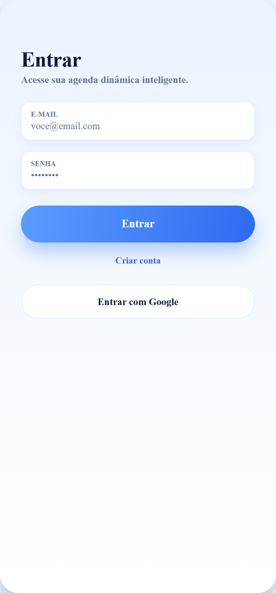
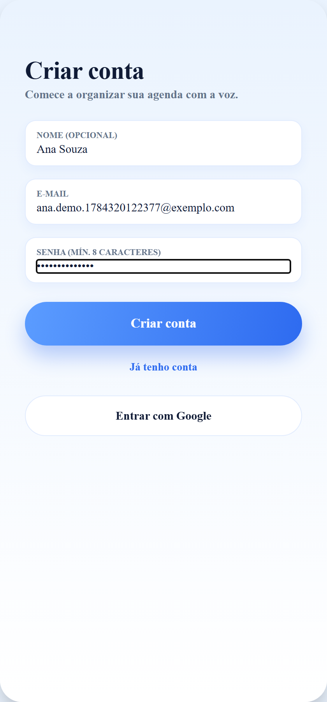
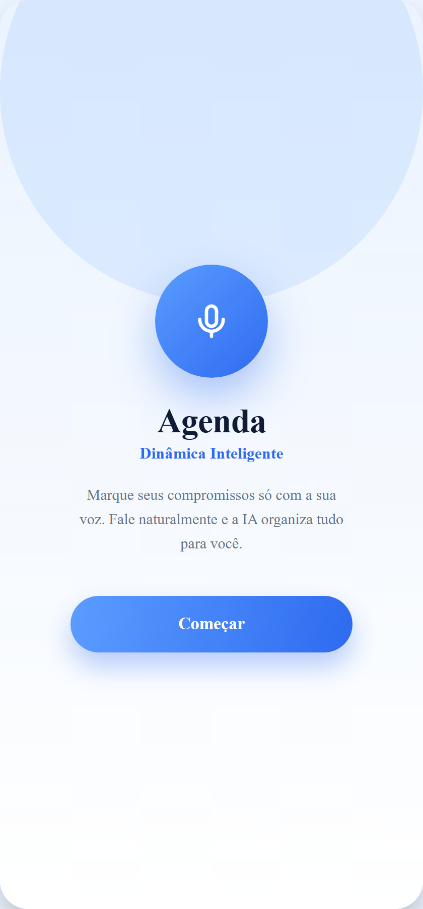
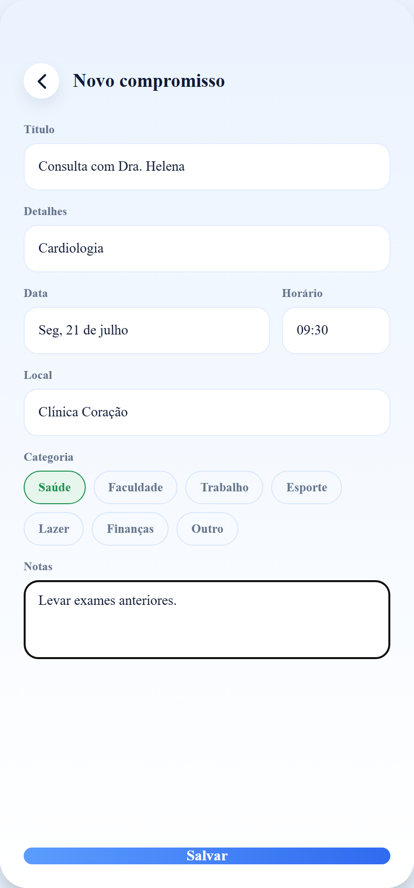
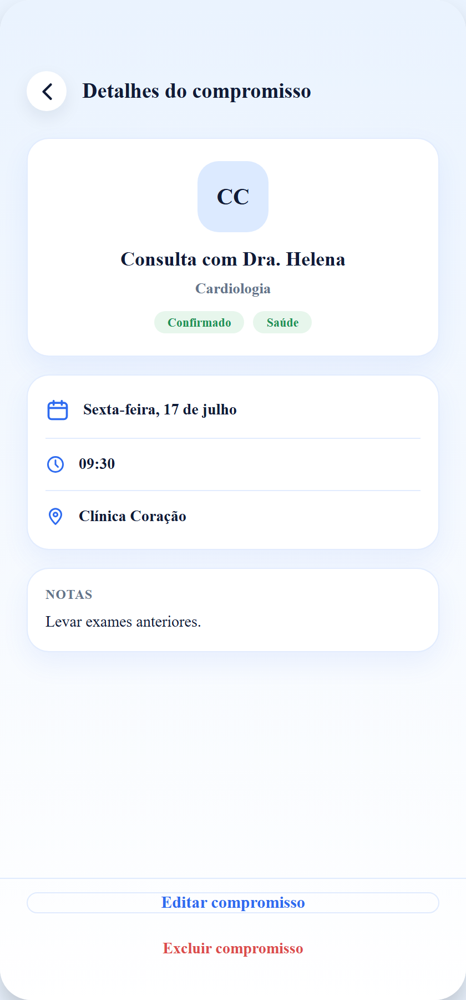
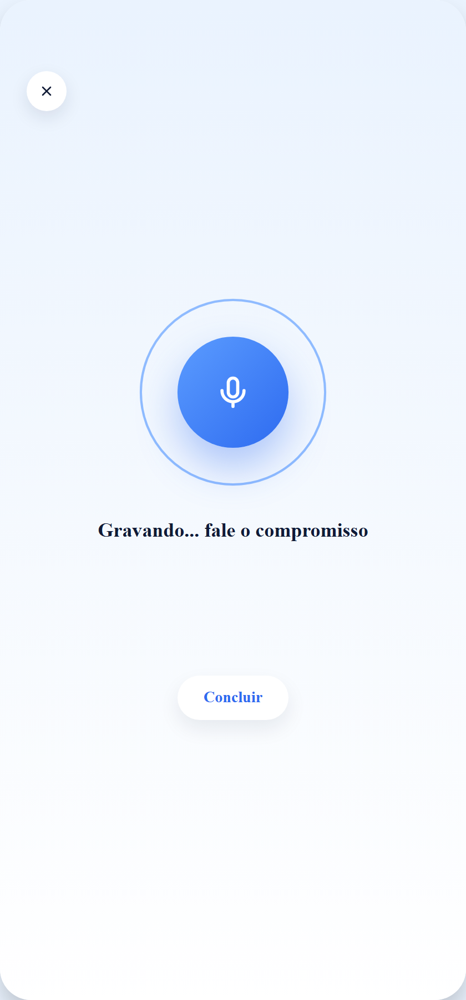
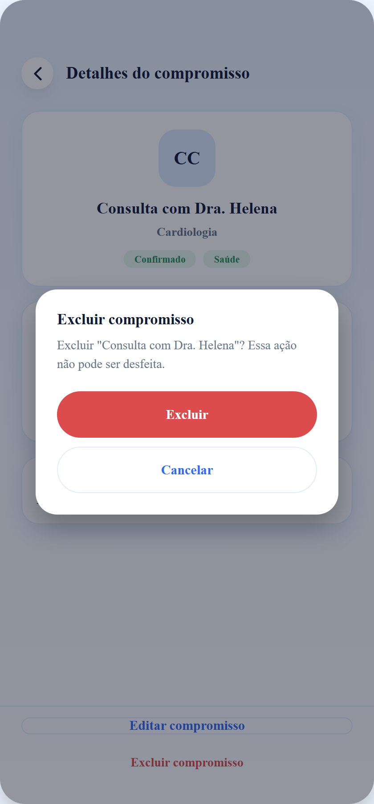
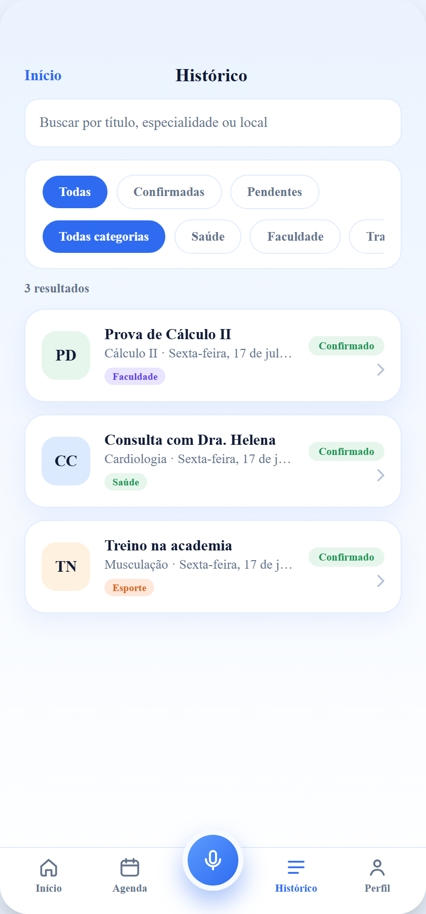
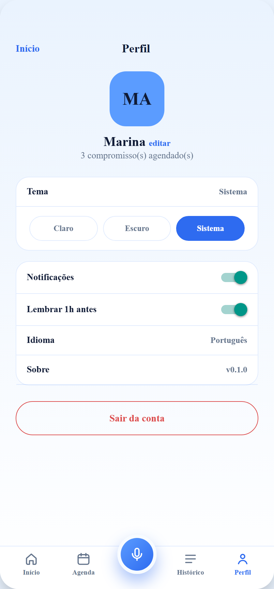
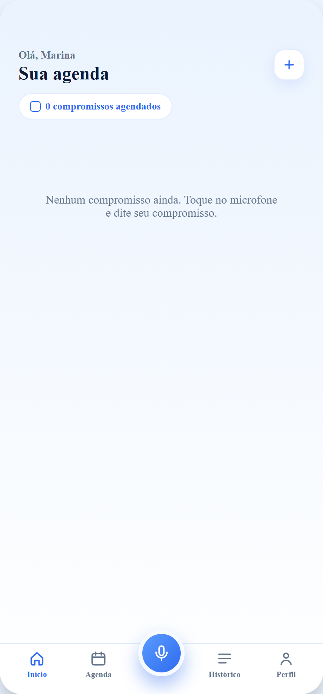

<div align="center">


# Agenda Dinâmica Inteligente

**Marque seus compromissos só com a voz.** Fale naturalmente — o app grava, a IA transcreve e extrai os dados do compromisso (título, data, horário, local, categoria), você confirma e pronto.


</div>

---

## Sobre

App de **agenda de compromissos por voz** — consultas médicas, aulas, provas, treinos, reuniões, lazer e o que mais precisar agendar. Construído em **React Native + Expo** (roda no Android, iOS e web), com **backend próprio** em funções serverless na Vercel, banco **Postgres (Neon)**, autenticação **email/senha + Google**, e transcrição/extração de voz via **IA (Groq)**.

O fluxo central: você toca no microfone, fala o compromisso, e a IA devolve um evento estruturado numa tela de confirmação. Sem digitar formulário.

## Principais funcionalidades

- 🎙️ **Agendamento por voz** — grava o áudio e a IA extrai título, detalhes, data, horário, local, categoria e notas.
- ✍️ **Cadastro/edição manual** — formulário completo com seletor de categoria, para quem preferir digitar.
- 📅 **Agenda mensal** — calendário com dias selecionáveis e a lista do dia.
- 🗂️ **Histórico** — busca + filtros por status e por categoria.
- 🔔 **Lembretes locais** — notificação na hora do compromisso (ou 1h antes), configurável. *(entrega confiável no app nativo — ver [Notificações](#notificações))*
- 🔐 **Contas multiusuário** — cadastro/login por email/senha ou Google; cada conta vê só os seus compromissos.
- 👤 **Perfil** — nome editável, tema claro/escuro/sistema, preferências de lembrete, logout.
- 🌗 **Tema claro/escuro** com paleta azul e tipografia Manrope.
- 📲 **Instalável** — como PWA (web) ou APK nativo (Android).

## Telas

<table>
  <tr>
    <td align="center"><br><sub><b>Login</b> — email/senha ou Google</sub></td>
    <td align="center"><br><sub><b>Cadastro</b> — validação amigável</sub></td>
    <td align="center"><br><sub><b>Onboarding</b></sub></td>
  </tr>
  <tr>
    <td align="center"><br><sub><b>Início</b> — lista de compromissos</sub></td>
    <td align="center"><br><sub><b>Novo compromisso</b> — com categorias</sub></td>
    <td align="center"><br><sub><b>Detalhes</b> — editar / excluir</sub></td>
  </tr>
  <tr>
    <td align="center"><br><sub><b>Escuta</b> — agendamento por voz</sub></td>
    <td align="center"><br><sub><b>Excluir</b> — confirmação no app</sub></td>
    <td align="center"><br><sub><b>Agenda</b> — calendário mensal</sub></td>
  </tr>
  <tr>
    <td align="center"><br><sub><b>Histórico</b> — busca + filtros</sub></td>
    <td align="center"><br><sub><b>Perfil</b> — tema, lembretes, logout</sub></td>
    <td align="center"><br><sub><b>Início vazio</b> — conta nova</sub></td>
  </tr>
</table>

## Fluxo da voz

```
HomeScreen (FAB do microfone) → startVoice()
  └─ recorderService (expo-av)      grava m4a (nativo) / webm (web)
       └─ aiService → /api/extract   proxy serverless com a chave da Groq (server-side)
            └─ Groq Whisper           transcreve o áudio (pt-BR)
                 └─ Groq (chat)        extrai o JSON do compromisso
                      └─ parseExtractionResponse()   valida/normaliza no cliente (testado)
                           └─ ConfirmScreen → salva no banco (ou local, se offline)
```

A chave da IA **nunca** vai para o bundle: o app chama o proxy `/api/extract` no mesmo domínio, e a `GROQ_API_KEY` fica no servidor.

## Tecnologias

### App (frontend)
| Tecnologia | Versão | Papel |
|---|---|---|
| Expo | SDK 54 | Framework/runtime multiplataforma (Android, iOS, web) |
| React Native | 0.81 | UI nativa |
| React | 19.1 | Biblioteca de componentes |
| react-native-web | 0.21 | Renderização web da mesma base |
| TypeScript | 5.9 | Tipagem estática |
| NativeWind | 4 | Tailwind CSS no React Native |
| Tailwind CSS | 3.4 | Design tokens / utilitários |
| expo-linear-gradient | 15 | Gradientes do design |
| react-native-svg | 15 | Ícones vetoriais |
| @expo-google-fonts/manrope | — | Tipografia Manrope |
| expo-av | 16 | Gravação de áudio (voz) |
| expo-notifications | 0.32 | Lembretes locais |
| expo-file-system | 19 | Leitura do áudio gravado (base64) |
| AsyncStorage | 2.2 | Persistência local (preferências / cache) |

### Backend (funções serverless na Vercel — `api/`)
| Tecnologia | Papel |
|---|---|
| Vercel Serverless Functions | Endpoints de auth, compromissos e proxy de IA |
| @neondatabase/serverless | Driver HTTP para o Postgres (Neon), sem pool |
| Neon (PostgreSQL) | Banco de dados (usuários, sessões, compromissos) |
| node:crypto | Hash de senha (**scrypt**) e tokens de sessão |
| Groq API | Transcrição (Whisper) + extração (chat) do compromisso |
| Google OAuth 2.0 | Login social |

### Qualidade
| Tecnologia | Papel |
|---|---|
| Vitest | Testes unitários da lógica pura (parsing/normalização, datas, categorias) |
| tsc (`--noEmit`) | Checagem de tipos |

## Arquitetura

- **Cliente** (`App.tsx` + `src/`): roteamento por tela via estado (sem navegação externa), estado global em Context (`AppContext`, `AuthContext`), serviços isolados (`aiService`, `recorderService`, `notificationService`, `apiClient`).
- **Persistência híbrida**: logado → compromissos no banco (escopados por usuário, server-side); offline/sem login → cache local. O servidor é dono do `id` e do escopo por usuário.
- **Autenticação**: senha com **scrypt** (salt por usuário, comparação em tempo constante); sessão por **token opaco de 256 bits** (o banco guarda só o **sha256** do token); cookie `HttpOnly + Secure + SameSite=Lax` no web e Bearer no nativo.
- **Proxy de IA**: `/api/extract` resolve CORS e mantém a chave server-side.

### Endpoints (`api/`)
| Método | Rota | Descrição |
|---|---|---|
| POST | `/api/auth/signup` | Cadastro email/senha → sessão |
| POST | `/api/auth/login` | Login email/senha → sessão |
| POST | `/api/auth/logout` | Encerra a sessão |
| GET | `/api/auth/me` | Usuário logado (ou 401) |
| GET | `/api/auth/google/start` | Inicia o login com Google |
| GET | `/api/auth/google/callback` | Retorno do Google (uso interno) |
| GET/POST | `/api/appointments` | Lista / cria compromissos do usuário |
| PUT/DELETE | `/api/appointments/:id` | Atualiza / remove um compromisso |
| POST | `/api/extract` | Proxy de IA: áudio → JSON do compromisso |

## Estrutura de pastas

```
App.tsx                       # shell + roteador por tela (DeviceFrame)
index.tsx                     # entrypoint (carrega a fonte Manrope)
api/                          # funções serverless da Vercel
├─ _lib/                      # db (Neon), http, cookies, crypto, sessão
├─ auth/                      # signup, login, logout, me, google/*
├─ appointments*              # CRUD de compromissos
└─ extract.js                 # proxy de IA (Groq)
db/schema.sql                 # schema idempotente (usuários, sessões, compromissos)
public/                       # manifest PWA + ícones (SVG) para o web
scripts/inject-pwa.mjs        # injeta o manifest no build web
src/
├─ context/                   # AppContext (estado do app), AuthContext (sessão)
├─ screens/                   # Onboarding, Login, Signup, Home, Listening, Confirm, Details, Edit, Calendar, History, Profile
├─ components/                # ui (botões, ConfirmDialog…), icons, AppointmentCard, BottomNav
├─ services/                  # aiService, recorderService, notificationService, authService, apiClient
├─ storage/                   # appointmentApi (banco), appointmentStorage / settingsStorage (local)
├─ theme/                     # ThemeProvider (claro/escuro)
└─ utils/                     # datas, categorias, cores, helpers
```

## Como rodar (desenvolvimento)

```bash
npm install
cp .env.example .env      # opcional; sem chaves o app roda em modo mock de voz
npx expo start            # Expo Dev Tools (Expo Go / emulador)
```

Web: `npx expo start --web` · iOS: `--ios` · Android: `--android`
Checagem de tipos: `npm run typecheck` · Testes: `npm test`

## Variáveis de ambiente

### Servidor (Vercel → Settings → Environment Variables) — **sem** prefixo `EXPO_PUBLIC_`
| Variável | Obrigatória | Descrição |
|---|---|---|
| `DATABASE_URL` | ✅ (auth) | Connection string do Neon (injetada pela integração Storage). Também aceita `POSTGRES_URL` e afins. |
| `GROQ_API_KEY` | ✅ (voz) | Chave da Groq usada pelo `/api/extract` |
| `GROQ_MODEL` | ⬜ | Modelo de chat (default `openai/gpt-oss-20b`) |
| `GROQ_TRANSCRIBE_MODEL` | ⬜ | Modelo de transcrição (default `whisper-large-v3-turbo`) |
| `GOOGLE_CLIENT_ID` / `GOOGLE_CLIENT_SECRET` | ⬜ (login Google) | Credenciais do Google Cloud |
| `APP_URL` | ⬜ | `https://SEU-APP.vercel.app` (senão é derivado do host) |
| `PROXY_AUTH_TOKEN` | ⬜ | Protege o `/api/extract` contra abuso de quota |
| `RATE_LIMIT_MAX` | ⬜ | Máx. de requisições por IP/min no proxy (default `10`) |

### Cliente (`EXPO_PUBLIC_*`, embutidas no bundle em *build time*)
Nenhuma é necessária no deploy web: em produção o app usa o proxy **same-origin** (`/api/extract`). Opcionais para nativo/self-host: `EXPO_PUBLIC_API_BASE`, `EXPO_PUBLIC_AI_PROXY_URL`. **Nunca** coloque chave de IA direta em `EXPO_PUBLIC_*` num build público — ela vaza no bundle.

## Deploy

### Web (Vercel)
Já configurado no `vercel.json` — build com `expo export --platform web` + injeção do manifest PWA. Conecte o repositório na Vercel, crie o banco Neon (aba **Storage**), rode `db/schema.sql` no console do Neon, defina as variáveis do servidor e faça deploy. Instalável como **PWA** (Chrome → "Instalar app").

### Android nativo (APK via EAS)
```bash
npx eas-cli login
npx eas build:configure
npx eas build -p android --profile preview   # gera um APK para baixar e instalar
```

## Notificações

- **Nativo (APK):** `expo-notifications` agenda lembretes **locais reais**, registrados no sistema — disparam **mesmo com o app fechado** (canal Android de alta prioridade configurado).
- **Web/PWA:** por limitação da plataforma, o lembrete só dispara **enquanto o app está aberto** (`setTimeout` + Notification API). Notificação em segundo plano na web exigiria Web Push (service worker + servidor). **Para lembretes confiáveis, use o build nativo.**

## Segurança

- Senhas com **scrypt** (salt aleatório por usuário, comparação em tempo constante) — nunca em texto puro.
- Sessão por token opaco; o banco guarda só o **hash sha256** (vazamento do banco não expõe sessões).
- Cookie `HttpOnly + Secure + SameSite=Lax` (mitiga XSS/CSRF).
- Login errado devolve a mesma mensagem para email inexistente e senha errada (não revela cadastros).
- Chaves de IA **server-side** (proxy) — fora do bundle.
- Rate limit por IP no `/api/extract`.

## Status

Funcional de ponta a ponta: auth (email/senha + Google), compromissos no banco por usuário, voz real (Groq) no deploy web, exclusão com confirmação, tema claro/escuro, PWA instalável. Testes unitários da lógica pura (Vitest); notificações confiáveis via build nativo.

---

<div align="center">
<sub>Feito com React Native + Expo · Backend serverless na Vercel · Postgres no Neon</sub>
</div>
